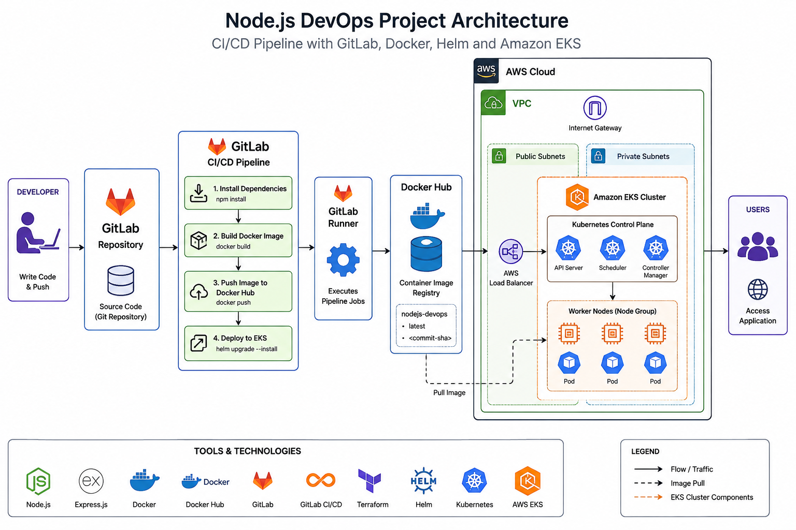
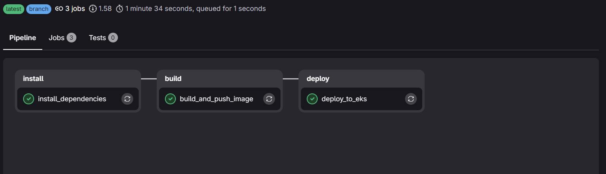
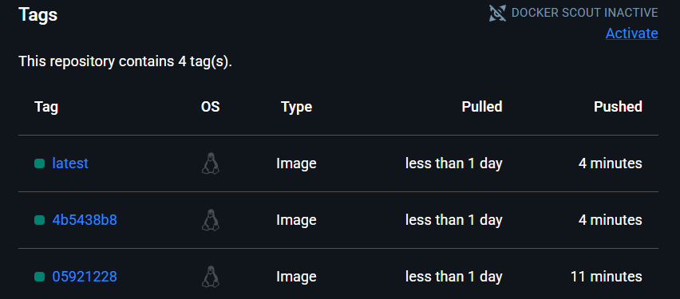
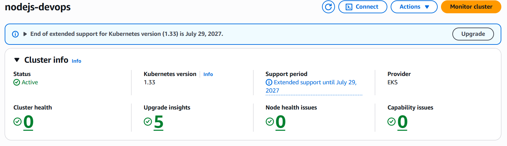
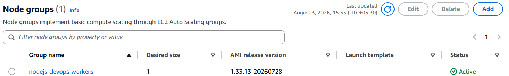
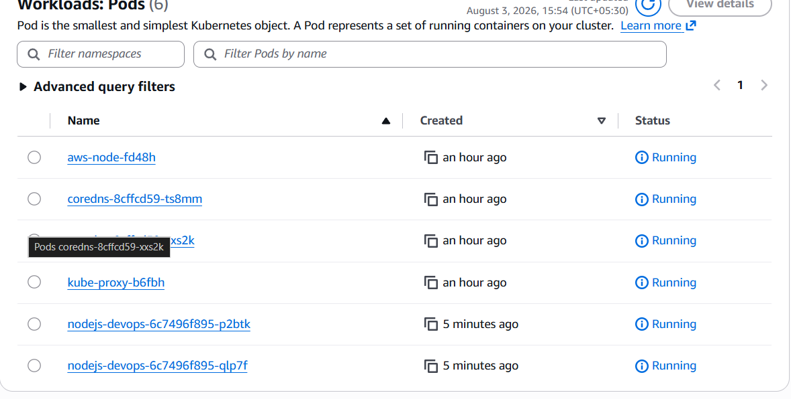
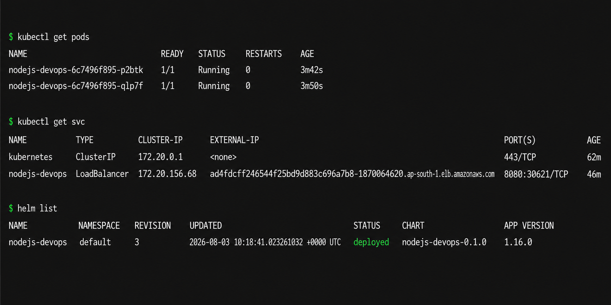

# 🚀 Node.js DevOps Project


A production-style DevOps project demonstrating an end-to-end CI/CD pipeline for deploying a containerized Node.js application on **Amazon EKS** using **Terraform**, **Docker**, **Helm**, and **GitLab CI/CD**.

---

# 📑 Table of Contents

- Project Overview
- Architecture
- Project Workflow
- Technologies Used
- Features
- Project Structure
- Infrastructure Provisioning
- Docker
- Kubernetes
- Helm
- GitLab CI/CD
- Getting Started
- Screenshots
- Cleanup
- Future Improvements

---

# 📖 Project Overview

This project demonstrates how modern DevOps practices can automate the complete application deployment lifecycle.

The infrastructure is provisioned using Terraform, the application is containerized using Docker, stored in Docker Hub, and automatically deployed to Amazon EKS through a GitLab CI/CD pipeline using Helm.

The pipeline performs:

- Install Dependencies
- Build Docker Image
- Push Image to Docker Hub
- Deploy to Amazon EKS
- Rolling Updates

---

## 🏗️ Architecture



This project implements a complete CI/CD pipeline for a containerized Node.js application using GitLab CI/CD, Docker, Docker Hub, Terraform, Helm, Kubernetes, and Amazon EKS.

The workflow is:

1. Developer pushes code to the GitLab repository.
2. GitLab CI/CD triggers the pipeline.
3. Docker image is built and pushed to Docker Hub.
4. Terraform provisions the AWS infrastructure.
5. Helm deploys the application to Amazon EKS.
6. Kubernetes performs rolling updates and manages the application pods.
7. Users access the application through the AWS Load Balancer.
---

# 🔄 Project Workflow

```text
Developer
      │
      ▼
Git Push
      │
      ▼
GitLab Repository
      │
      ▼
GitLab CI/CD Pipeline
      │
      ▼
Build Docker Image
      │
      ▼
Push Image to Docker Hub
      │
      ▼
Amazon EKS
      │
      ▼
Helm Upgrade
      │
      ▼
Kubernetes Deployment
      │
      ▼
Pods
      │
      ▼
LoadBalancer
      │
      ▼
Users
```

---

# 🛠️ Technologies Used

| Category | Technology |
|----------|------------|
| Cloud | AWS |
| IaC | Terraform |
| Containers | Docker |
| Registry | Docker Hub |
| Orchestration | Kubernetes |
| Package Manager | Helm |
| CI/CD | GitLab CI/CD |
| Language | Node.js |
| Framework | Express.js |
| Version Control | Git & GitLab |

---

# ✨ Features

- Infrastructure as Code using Terraform
- Automated AWS EKS provisioning
- Dockerized Node.js application
- GitLab CI/CD automation
- Docker Hub image publishing
- Helm-based deployment
- Rolling updates
- Kubernetes self-healing
- Scalable architecture

---

# 📂 Project Structure

```text
nodejs-express-mysql/
│
├── architecture/
├── screenshots/
├── helm/
├── kubernetes/
├── terraform/
├── Dockerfile
├── docker-compose.yml
├── package.json
├── server.js
├── .gitlab-ci.yml
└── README.md
```

---

# ☁️ Infrastructure Provisioning

Terraform creates:

- VPC
- Public Subnets
- Internet Gateway
- Route Tables
- Security Groups
- IAM Roles
- Amazon EKS Cluster
- Managed Node Group

---

# 🐳 Docker

The application is containerized using Docker.

Docker images are automatically built and pushed to Docker Hub during every GitLab pipeline execution.

Image Tags:

- latest
- Git Commit SHA

Example:

```text
hitesh008/nodejs-devops-project:latest
hitesh008/nodejs-devops-project:4b5438b8
```

---

# ☸️ Kubernetes

The application is deployed using:

- Deployment
- ReplicaSet
- Pods
- Service (LoadBalancer)

Kubernetes provides:

- Self-Healing
- Rolling Updates
- High Availability
- Scalability

---

# ⛵ Helm

Helm is used to package and deploy the application.

Deployment command:

```bash
helm upgrade --install nodejs-devops ./helm/nodejs-devops
```

---

# 🔄 GitLab CI/CD

The pipeline consists of three stages:

1. Install
2. Build
3. Deploy

Deployment Flow:

```text
Code Push
      │
      ▼
Install Dependencies
      │
      ▼
Build Docker Image
      │
      ▼
Push Docker Image
      │
      ▼
Deploy to Amazon EKS
```

---

# 🚀 Getting Started

### Clone Repository

```bash
git clone https://github.com/<your-username>/nodejs-devops-project.git
```

### Install Dependencies

```bash
npm install
```

### Run Application

```bash
npm start
```

### Build Docker Image

```bash
docker build -t nodejs-devops-project .
```

### Deploy Infrastructure

```bash
cd terraform

terraform init
terraform plan
terraform apply
```

### Deploy using Helm

```bash
helm upgrade --install nodejs-devops ./helm/nodejs-devops
```

---

## 📸 Screenshots

# 📸 Project Screenshots

## GitLab CI/CD Pipeline

The GitLab CI/CD pipeline automatically installs dependencies, builds the Docker image, pushes it to Docker Hub, and deploys the latest version to Amazon EKS.



---

## Docker Hub Repository

Docker images are versioned and stored in Docker Hub, making them available for deployment to the Kubernetes cluster.



---

## Amazon EKS Cluster

The Amazon EKS cluster hosts the Kubernetes control plane used to manage the application deployment.



---

## Amazon EKS Node Group

The managed node group provides the worker nodes that run the application's Kubernetes pods.



---

## Kubernetes Workloads

The Node.js application pods and Kubernetes system components are running successfully in the cluster.



---

## Kubernetes CLI Verification

Deployment verification using Kubernetes and Helm commands.

The screenshot demonstrates:
- Running application pods
- LoadBalancer service
- Successful Helm release


# 🧹 Cleanup

Destroy the infrastructure:

```bash
cd terraform

terraform destroy
```

---

# 🚀 Future Improvements

- Implement ArgoCD (GitOps)
- Add Prometheus Monitoring
- Add Grafana Dashboards
- Integrate SonarQube
- Add Trivy Image Scanning
- Add Horizontal Pod Autoscaler
- Deploy with Ingress Controller

---

# 👨‍💻 Author

**Jyotiraj Mahanta**

DevOps | AWS | Docker | Kubernetes | Terraform | GitLab CI/CD